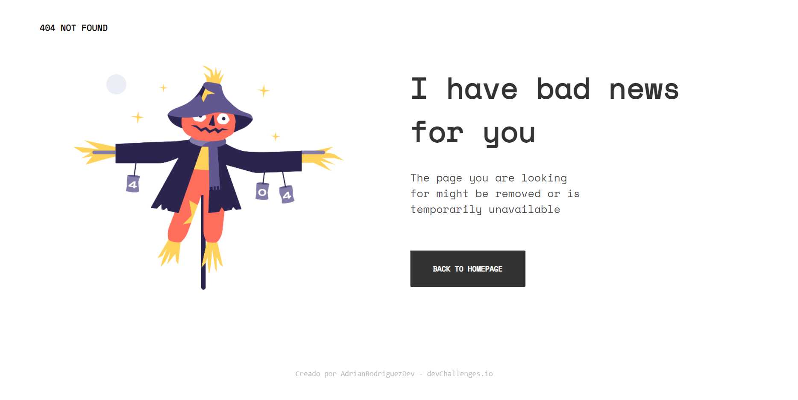

<h1 align="center">404 Not Found Challenge - Solution</h1>

   Solution for a challenge from  <a href="http://devchallenges.io" target="_blank">Devchallenges.io</a>.

  <h3>
    <a href="https://adrianrdz17.github.io/404-not-found-challenge/">
      Demo
    </a>
     | 
    <a href="https://devchallenges.io/solutions/Nvq9cz2CHfcCToFCjIhZ">
      Solution
    </a>
     | 
    <a href="https://devchallenges.io/challenges/wBunSb7FPrIepJZAg0sY">
      Challenge
    </a>
  </h3>

<!-- TABLE OF CONTENTS -->

## Table of Contents

- [Overview](#overview)
  - [Built With](#built-with)
- [Features](#features)
- [Contact](#contact)
- [Acknowledgements](#acknowledgements)

<!-- OVERVIEW -->

## Overview

This is my first use of responsive design. I hope you like it.

### Built With

- HTML
- CSS

## Features

This application/site was created as a submission to a [DevChallenges](https://devchallenges.io/challenges) challenge. The [challenge](https://devchallenges.io/challenges/wBunSb7FPrIepJZAg0sY) was to build an application to complete the given user stories.

## Acknowledgements

- [Steps to replicate a design with only HTML and CSS](https://devchallenges-blogs.web.app/how-to-replicate-design/)
- [Grid - CSS Reference](https://cssreference.io/css-grid/)

## Contact

- GitHub [@adrianrdz17](https://github.com/adrianrdz17)
- Facebook [Adrian Rodriguez](https://www.facebook.com/a.rod2612/)
